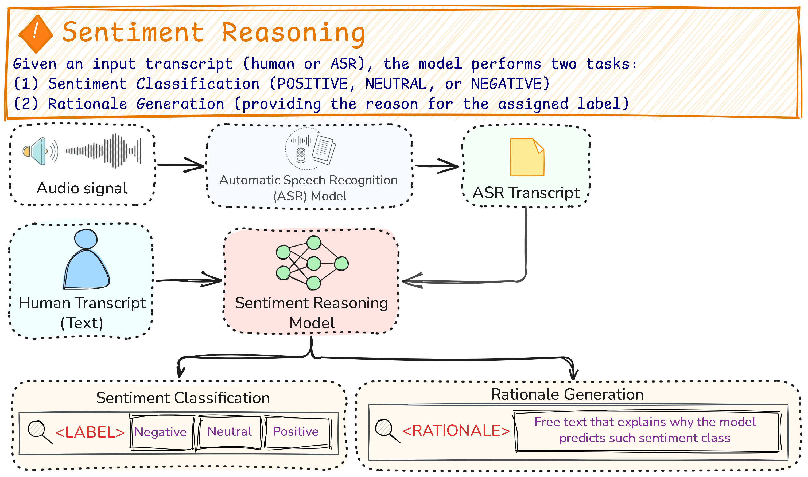

# Sentiment Reasoning in Healthcare (Vietnamese) — Reproduction & Demo Pipeline

This repository reproduces and demonstrates the **Sentiment Reasoning** task for Vietnamese healthcare conversations, following the paper **“Sentiment Reasoning for Healthcare” (arXiv:2407.21054)**.

**Sentiment Reasoning** extends standard sentiment analysis by jointly predicting:
1) **Sentiment label**: `positive | neutral | negative`  
2) **Rationale**: a short natural-language explanation for the predicted label.

The demo supports both:
- **Text-only** (human transcript)
- **Speech-to-text** → **ASR transcript** → sentiment reasoning

>  Healthcare is a high-stakes domain. This repo is for research/education. Do not use outputs as medical advice.

---

## Paper
- Title: *Sentiment Reasoning for Healthcare* (arXiv:2407.21054)
- Task: sentiment classification + rationale generation for both speech & text.

Please cite the original paper if you use the dataset or ideas.

---

## Dataset
We use the Vietnamese split of the **Sentiment-Reasoning** dataset:
- Vietnamese subset: **8,086 samples**
  - Train: **5,695**
  - Test: **2,183**
- Each sample includes:
  - `text` (Vietnamese conversation transcript)
  - `label` (positive/neutral/negative)
  - `human_justification` (human-written rationale)
  - `audio` (healthcare conversation audio; ~7–8 seconds on average)

Hugging Face dataset:
- `leduckhai/Sentiment-Reasoning`

---

## Pipeline Overview



### A) Speech pipeline (multimodal)
`audio` → **ASR** → `transcript` → (Encoder / Seq2Seq / LLM) → `LABEL + RATIONALE`

ASR backends in this repo:
- **PhoWhisper-large** (Transformers pipeline)
- **sherpa-onnx Zipformer (vi)** (local inference)

ASR quality can be evaluated with:
- WER / CER / MER

### B) Text pipeline
`human transcript` → (Encoder / Seq2Seq / LLM) → `LABEL + RATIONALE`

---

## Models in this project

### 1) Encoder (classification baselines)
- **PhoBERT** (Vietnamese RoBERTa-style encoder)
- **ViHealthBERT** (Vietnamese medical-domain BERT)

### 2) Encoder–Decoder (label + rationale generation)
- **BARTPho**
- **ViT5** (and optional fine-tuned checkpoint)

### 3) Decoder-only LLMs (prompting / LoRA adapters)
- **Qwen3-8B**
- **Vistral-7B**
- **Llama-3.x-8B**
(loaded with 4-bit quantization + PEFT adapters)

---

## Output Format

All generative models/LLMs follow a strict format:
`LABEL: <negative|neutral|positive> | RATIONALE: <short Vietnamese explanation>`

This makes parsing + scoring easy.

---

## Installation

Install dependencies:
```bash
pip install -U datasets transformers accelerate peft bitsandbytes safetensors sentencepiece pandas huggingface_hub
pip install soundfile sherpa-onnx onnxruntime-gpu librosa scikit-learn

```
## Team Members
| Full Name            | University |
|----------------------|-------------|
| Mai Thị Kim Ngân     | University of Science – VNUHCM (HCMUS) |
| Lê Nguyễn Quỳnh Anh  | University of Science – VNUHCM (HCMUS) |
| Hồ Trần Anh Thư      | University of Science – VNUHCM (HCMUS) |
